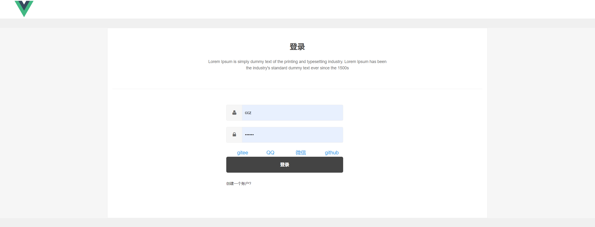

### 项目说明
cc-video是一个功能齐全的分布式项目，结合短信发送，视频上传，私信聊天，第三方登录功能。后端使用人人开源管理系统。

如果需要重新开发只需要把服务地址换成本地即可，如果服务有其他bug可以加我联系方式QQ:3044606584,也欢迎有兴趣的
小伙伴一起开发新的功能学习
<br>

### 测试地址
前端页面 http://43.248.97.192:9956 

账号 xiaozhao  
密码 123456

后端页面 http://43.248.97.192:9956/admin/index.html/

账号 admin  
密码 admin
### 具有如下特点
- 使用springboot+mybatis_plus+vue框架
- 使用oss对象存储视频和图片
- 使用Just-Auth项目集合第三方登录功能
- 使用websocket私信聊天并将聊天记录存储到数据库中
- 使用短信功能发送验证码，注册登录。
- 使用shiro做权限管理功能
- 完善的XSS防范及脚本过滤，彻底杜绝XSS攻击
- 使用nacos技术对模块进行集中管理
- 结合redis技术做ip地址频繁访问过滤，视频浏览记录缓存，热门视频推荐
- 使用定时任务将浏览记录和聊天记录存储到数据库中
- 支持支付宝沙箱支付
- 使用rabbitmq将创建的订单放入消息队列中并使用延时队列对订单状态做判断
- 支持邮件发送功能
  <br>
  

<br> 


**项目结构**
```
cc_video
├─renren-common     公共模块
│ 
├─renren-admin      管理后台
│    ├─db  数据库SQL脚本
│    │ 
│    ├─modules  模块
│    │    ├─job 定时任务
│    │    ├─log 日志管理
│    │    ├─oss 文件存储
│    │    ├─security 安全模块
│    │    └─sys 系统管理(核心)
│    │ 
│    └─resources 
│        ├─mapper   MyBatis文件
│        ├─public  静态资源
│        └─application.yml   全局配置文件
│       
│ 
├─renren-api        API服务
│       
├─renren-gateway   服务网关
│        └─config   跨域配置
│
│       
├─video-admin-web  cc-video功能模块
│
│ 
├─video-third-part 第三方功能模块
│
│ 
├─video-admin-vue  后端页面
│
│ 
├─video-front-vue  前端页面
```

<br>

<br>

**软件需求**
- JDK1.8
- Maven3.0+
- MySQL8.0
- Oracle 11g+
- SQL Server 2012+
- PostgreSQL 9.4+
- 达梦8
<br>

### 所用技术

| 后端技术     | 版本    |
| --------   | -----:  |
| jdk  | 1.8 |
| maven  | 3.0+ |
| springboot        | 2.3.2.RELEASE      |  
| mysql        | 8.0.21      |  
| redis        | 4.2.2      | 
| springcloudalibaba        | Hoxton.SR6      | 
| nacos        | 2.2.1.RELEASE      |
| openfeign        | 2.2.1.RELEASE       |  
| gateway        | 2.2.3.RELEASE    | 
| mybatis_plus        | 3.5.2     | 
| rabbitmq       | 2.2.1.RELEASE     | 
| websocket        | 2.3.2.RELEASE       |  
| shiro        | 1.10.0      |  
| jwt        | 0.7.0      |


| 前端技术     | 版本    |
| --------   | -----:  |
| nodejs        | 12.14.0      |  
| vue        |      |  
| element-ui        |       | 
| vueX        |       | 
| axios        |       |
| cookie        |       | 

！！nodejs最好版本一致。


### 页面展示





